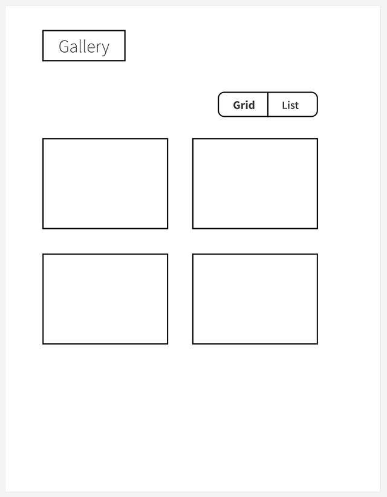
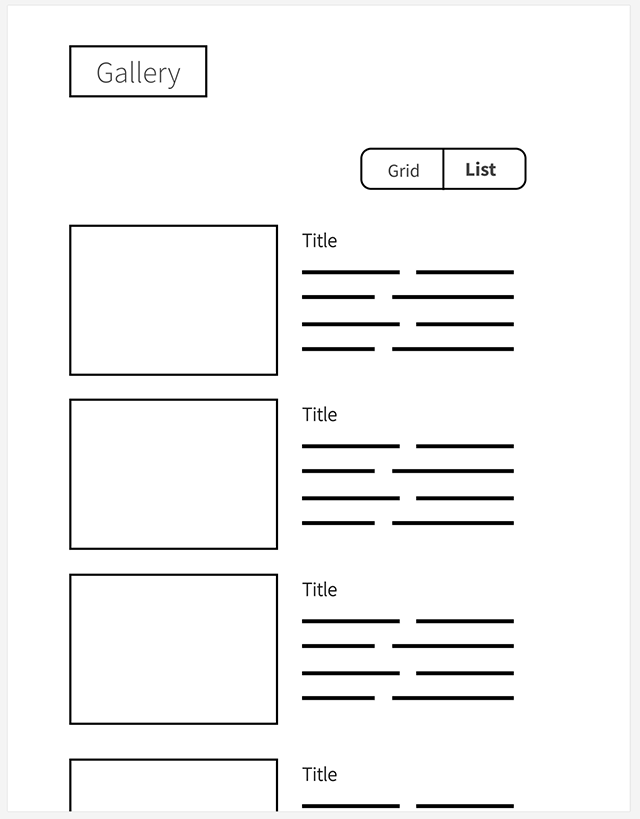

# Hiring-FE-gallery

A sandbox project to build a gallery.

This project was bootstrapped with [Create React App](https://github.com/facebook/create-react-app).

## What we're building

Our goal is to build a simple image gallery with the ability to display a static list of photos either in grid mode or list mode.

_Grid mode:_

_List mode:_

## Getting started

Install the required dependencies:

`npm install`

In the project directory, you can run:

`yarn start`

That runs the app in the development mode. 
Open [http://localhost:3000](http://localhost:3000) to view it in the browser.

The page will reload if you make edits. 
You will also see any lint errors in the console.

## Resources for the project

* `images.json` contains the list of images
* The actual image files are in `public/images/*.jpg`
* `translations.json` contains translations of UI element labels
